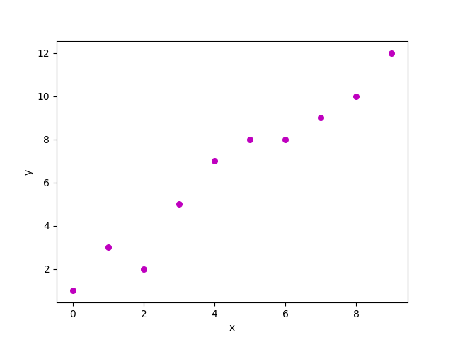
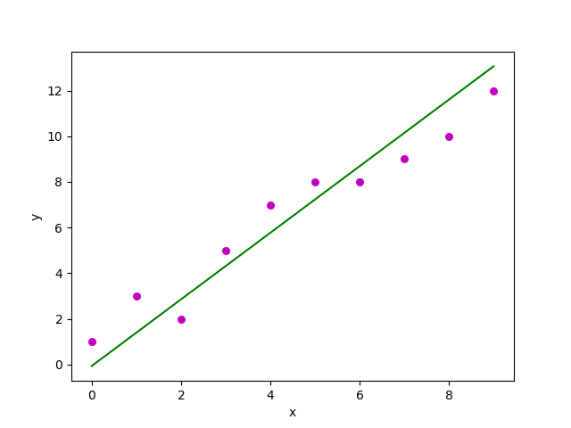

Arbetsflöde för AI-Projekt

## Syftet med Rapporten är att teoretisk beskriva hur databehandling fungerar, hur man kan visualisera data och hur man kan med hjälp av maskininlärningsalgoritmen linjär regression förutspå huspriser

**Grundläggande**

Datainsamling sker oftast genom dataset, olika databaser, cookies från hemsidor eller andra verktyg som har information om hus, prishistorik, antal rum m.m. När man har all data så omvandlar man data till en format som skulle passa till exempel bilder, grafer eller tabeller. I detta fallet en graf. Data går sedan att spara på olika sett som till exempel Lokal, databas, molntjänst eller datalager.

Data man samlar in kallas rådata och är inte möjlig att använda för analys utan flera steg krävs innan man kan träna en modell.
rådata blir kollad for eventuella fel, duplikation, felräkningar eller saknad data för sedan bli anpassad för analys.
Detta görs för att få så bra resultat som möjligt men också för att maskininlärningsalgoritmer läser bara numerisk.

**Visualisering av data**

När man arbetar med data kan det bli svårt att förstå data i en tabell eller CSV fil. För att få en bättre blick av data och kunna välja rätt modell för en specifik data, är det enklare att visualisera eller ha data i en illustrerad form, som grafer, bilder och diagram. Det gör också att man kan få ut mer av data och se mönster, trender som man kanske inte såg i en vanlig CSV fil. Människan har även enklare att bearbeta och förstå data på det sättet.

**Metoder att visualisera data**

Data går att visualiseras på många olika sett men fokus kommer vara på Python. Python har flera olika bibliotek som Matplotlib, Seaborn, ploty och m.m. Alla har olika för- och nackdelar, Seaborn är mer för att analysera statistik medans Matplotlib är för enklare grafer och diagram och används oftast för data listor, går även att para ihop med NumPy och pandas, vilket gör det till ett bättre alternative för förutspå huspriser.

**Vad är linjär regression**

Linjär regression är den mest grundläggande regression. Det är en data-analys teknik som kan uppskatta värdet av okända data med hjälp av kända och relaterade data. En linje dras för att bäst anpassa de relaterade data, linjen kan användas för att uppskatta till exempel huspriser i framtiden.

**Hur fungerar linjär regression i Python ?**

Data som är känd och relaterade läggs i en listor för att rita en spridningsdiagram(se bild 1 för resultat)

Steg:

1. Importeras Matplotlib och NumPy
2. Använd data som är relevant eller slumpmässig data, i detta fallet ska data vara relevant för att uppskatta framtidens hus pris
3. Hjälp av data skapar man en spridningsdiagram
4. Hjälp av NumPy och Matpotlib görs en linje
5. Göra den läsbar, lägg till titel och vad x, y axel representerar
6. Visa graf med hjälp av Matplotlib, som exempel (bild 2)


```
#kod för scatter plot
import numpy as np
import matplotlib.pyplot as plt

x = [5,7,8,7,2,17,2,9,4,11,12,9,6]
y = [99,86,87,88,111,86,103,87,94,78,77,85,86] 

plt.scatter(x, y)
plt.show()
```
<p float="left">
  
   
</p>


**Driftsätta modellen** 

När man en tränad modell vill man driftsätta modell för användning, det kommer att behöva kopplas in i något bredare produktionssystem som molnet.
Dem två främsta metoder man använder för träna om modeller med färskdata är batch inference och online inference. Batch kör i periodvis, medans online kör i real-time, det ger batch fördel med köra mer komplexa modeller.

**Exempel på teknologier som används i de olika stegen av maskininlärningsprocessen**

Datainsamling,
- Pandasm, Tweepy, Kaggle

Datarengöring,
- Pandas, Dora, NumPy

lagring,
- Lokal, Databas

Maskininlärning
- Python, TensorFlow, Scikit-learn

Visualisering,
- Matplotlib, plotly

Driftsätta modellen,
- AWS, Azure, Snowflake

**Källor**

https://www.simplilearn.com/tutorials/python-tutorial/data-visualization-in-python

https://www.w3schools.com/python/python_ml_linear_regression.asp

https://github.com/kokchun/AI-intro-AI22/blob/main/Resources/week3.md

https://saturncloud.io/blog/how-to-add-a-regression-line-in-python-using-matplotlib/

https://pro.arcgis.com/en/pro-app/latest/tool-reference/geoai/how-linear-regression-works.htm

https://aws.amazon.com/what-is/linear-regression/#:~:text=Linear%20regression%20is%20a%20data,variable%20as%20a%20linear%20equation.
 
https://www.data.cam.ac.uk/data-management-guide/creating-your-data/choosing-formats
